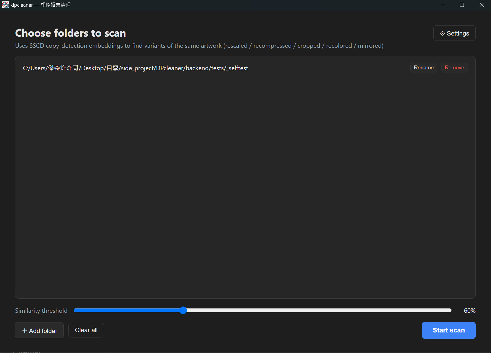
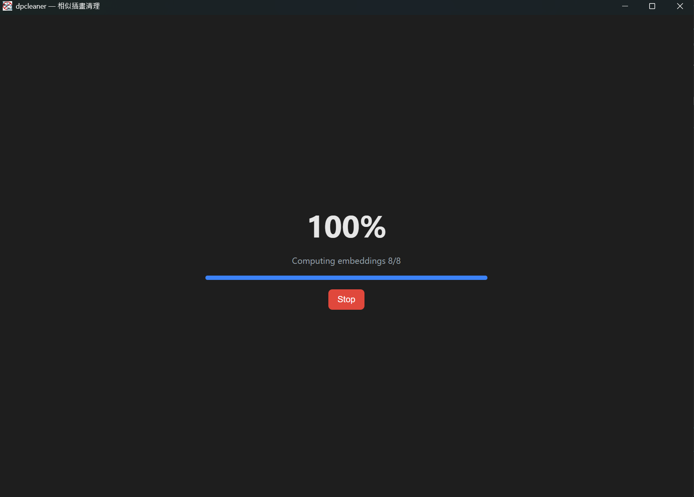
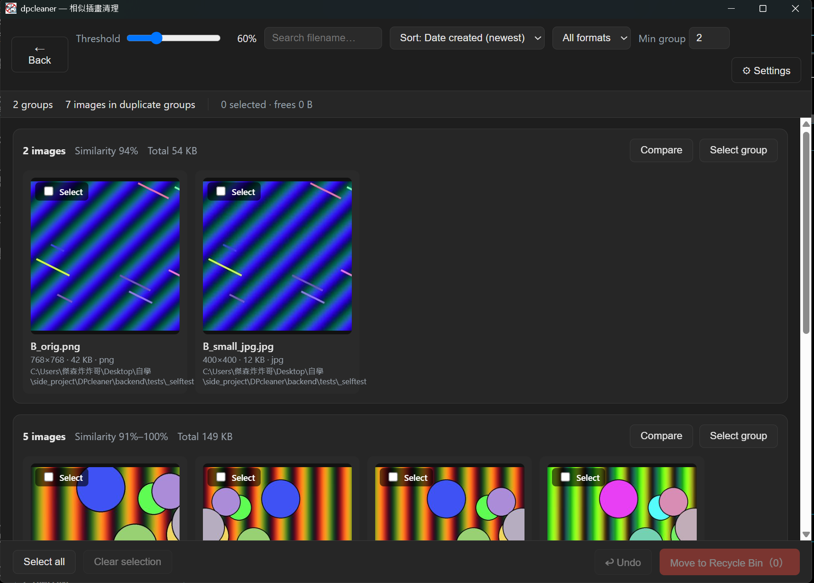
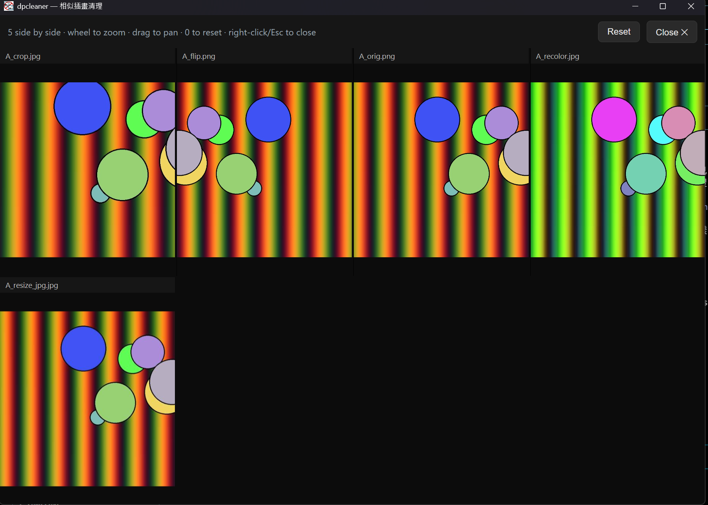
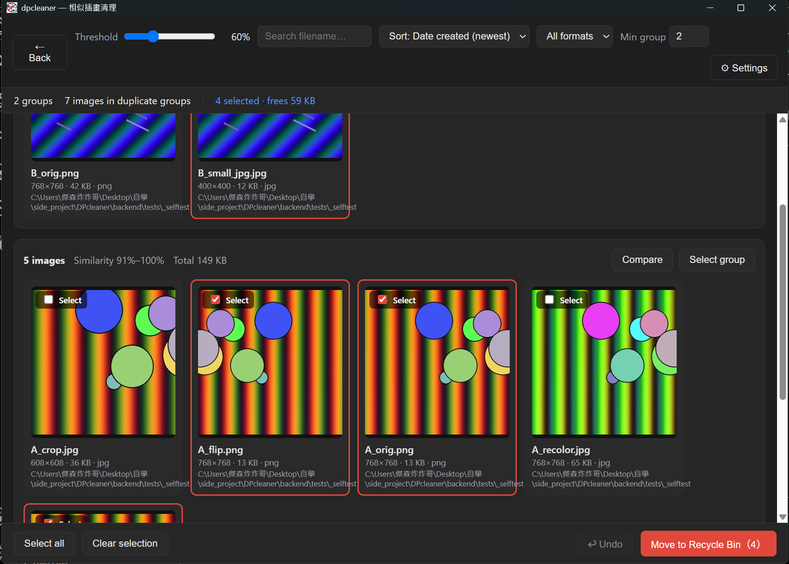

<div align="center">

# DPcleaner


**Find and clean up near-duplicate illustrations, right from your desktop.**
A personal learning project — open source, no ads, no telemetry.

[**Download**](#download) · [**Features**](#features) · [**FAQ**](#faq) · [**Development**](#development) · [**License**](#license)

**English** | [繁體中文](README.zh-TW.md)

</div>

---

Uses SSCD copy-detection embeddings to find different versions of the same artwork (rescaled, recompressed, cropped, recolored, mirrored) — common when saving art repeatedly from Pixiv or Twitter — so you can manually pick which copies to keep or send to the Recycle Bin.

> Personal learning side project, mainly to practice cross-language (Rust / Python / TypeScript) integration and engineering practices. Not a signed, sponsored, or actively-maintained product — just built for my own taskbar... er, desktop.

## Download

Grab an installer (`.msi` or `-setup.exe`) from [Releases](../../releases), double-click to install, and open — no Node/Rust/Python or any dev tooling required. The Python backend is bundled as a standalone executable via PyInstaller, packaged alongside the installer.

**Requirements:** Windows 10 or 11 (64-bit). The installer is **not code-signed**, so Windows SmartScreen will warn on first run ("Windows protected your PC") — click **More info → Run anyway**. Signing costs money this project doesn't have.

> There's no automated release pipeline yet; installers are built locally by the maintainer (see [Building an installer](#building-an-installer)) and uploaded manually.

## How it works

**1. Pick folders, set a threshold.** Click **+ Add folder** to open a folder picker, or just drag folders onto the window — add as many as you like. Each folder row has **Rename** (renumbers every image in that folder into a clean sequence — 001, 002... — with a live preview, adjustable start number/padding/prefix/sort order, and one-click undo) and **Remove** (drops it from the list); **Clear all** empties the whole list. The threshold slider (50–85%) controls how strict the match has to be: higher catches only near-identical copies, lower also catches more heavily edited variants (at the cost of more false positives). Click **Start scan** once you're ready.

<div align="center">
  
</div>

**2. Scan runs locally.** SSCD embeddings are computed for every image, with live progress. **Stop** cancels the scan at any point. The first scan downloads the ~94 MB model once; after that, only new or changed images need re-embedding.

<div align="center">
  
</div>

**3. Review the duplicate groups.** Each card is a group of matching images — thumbnails, dimensions, file size, folder, and similarity range. Use the search box, the format/sort dropdowns, and **Min group** to narrow things down. Per card, **Select group** checks every image in it at once, and **Compare** opens the side-by-side viewer. **⚙ Settings** (top right) holds app-wide options like language and theme.

<div align="center">
  
</div>

**4. Compare side-by-side.** **Compare** opens a synced zoom/pan viewer — scroll to zoom, drag to pan, `0` resets, and every image in the group moves together so you can line up the same region across versions. **Reset** restores the default view; **Close** (or right-click/Esc) goes back to the results screen.

<div align="center">
  
</div>

**5. Select and clean up.** Check the copies you don't want, across groups if you like — **Select all** / **Clear selection** toggle everything at once, and the toolbar shows the live count and how much space you'll free. **Move to Recycle Bin** sends the checked images to the real Windows Recycle Bin, so it's fully undoable — click **Undo** or press Ctrl+Z.

<div align="center">
  
</div>

## Features

🔍 **Similarity scan.** SSCD copy-detection embeddings find re-saved, rescaled, recompressed, cropped, recolored, or mirrored versions of the same artwork — with a live-adjustable similarity threshold.

🖼️ **Side-by-side compare.** Zoom and pan a duplicate group's images together, synced, so the same region lines up across every version.

🗑️ **Batch cleanup with undo.** Select across groups, send to the system Recycle Bin, and undo with one click (or Ctrl+Z).

🔢 **Batch rename with undo.** Renumber every image in a folder to a clean sequence (001, 002…), also undoable.

🔎 **Filter & sort.** Narrow the results by extension, filename, or minimum group size; sort by similarity or creation time.

🌐 **Multi-language.** Traditional Chinese, Simplified Chinese, English, and Japanese, with dark/light theme.

## FAQ

**Why does the first scan take a while?**
The SSCD model (~94 MB) downloads on first use and gets cached locally. After that, only new/changed images need re-embedding within a session.

**Is any of my data sent anywhere?**
No. Everything runs locally — scanning, embedding, and the recycle-bin operations never leave your machine. The embedding cache is in-memory only (cleared each restart) by design, for privacy.

**Why Windows only?**
The recycle-bin integration (and its undo support) is implemented against the Windows `$Recycle.Bin` format directly. Cross-platform support isn't a current goal for this learning project.

**Do I need an NVIDIA GPU?**
No — the packaged installer bundles the CPU build of the model, which works everywhere. If you build from source, you can opt into a CUDA build for faster embedding (see [Development](#development)).

## Built with

[Tauri](https://tauri.app/) · [FastAPI](https://fastapi.tiangolo.com/) · [React](https://react.dev/) + [Zustand](https://github.com/pmndrs/zustand) · [PyTorch](https://pytorch.org/) · the [SSCD](https://github.com/facebookresearch/sscd-copy-detection) copy-detection model from Meta AI Research.

---

<details>
<summary><h2 style="display: inline;">Development</h2> (click to expand)</summary>

Everything below is only needed if you want to contribute, read the source, or build your own installer.

### Architecture

```
DPcleaner/
├── src/            React + TypeScript frontend (Vite)
│   └── components/ Screens and components (Folders, Scanning, Results, etc.)
├── src-tauri/       Tauri (Rust) desktop shell — opens the window, spawns the Python backend
└── backend/         Python backend (FastAPI + SSCD embedding engine)
    └── dpcleaner/   One flat package: models/grouping (domain logic),
                      embedder/scanner/renamer/trash_gateway_port (ports/interfaces),
                      fs_scanner/sscd_embedder/sqlite_repo/fs_renamer/trash_gateway (adapters),
                      dedupe/rename (services), app/container/serializers/thumbs (API layer)
```

The frontend talks to the backend over REST (`/scan`, `/groups`, `/trash`, ...) plus a WebSocket (`/ws` for scan progress). The Tauri shell's only job is to spawn the Python subprocess and hand the frontend its port/token via the `backend_info` command.

### Dev environment setup

**Frontend:**

```bash
npm install
```

**Backend:**

```bash
python -m venv backend/.venv

# Pick one based on your hardware:
backend/.venv/Scripts/pip install torch torchvision --index-url https://download.pytorch.org/whl/cu124   # NVIDIA GPU
# or
backend/.venv/Scripts/pip install torch torchvision   # no GPU, CPU build

backend/.venv/Scripts/pip install -r backend/requirements.txt
```

### Running in dev

```bash
npm run tauri dev
```

### Building an installer

The backend needs to be packaged into a standalone `dpcleaner-server.exe` with PyInstaller first, so Tauri can bundle it into the installer (via Tauri's [externalBin](https://tauri.app/develop/sidecar/) mechanism). **Use the CPU build of torch** for packaging, not the dev `backend/.venv` — if that one has the CUDA build installed, the resulting installer balloons to several GB and only works for people with a matching GPU.

```bash
# 1. Create a dedicated CPU-only venv for packaging (one-time setup)
python -m venv backend/.venv-cpu
backend/.venv-cpu/Scripts/pip install torch torchvision --index-url https://download.pytorch.org/whl/cpu
backend/.venv-cpu/Scripts/pip install -r backend/requirements.txt pyinstaller pyinstaller-hooks-contrib

# 2. Package server_main.py into a single exe
backend/.venv-cpu/Scripts/pyinstaller \
  --name dpcleaner-server --onefile --noconsole \
  --distpath backend/dist_cpu --workpath backend/build --specpath backend \
  --paths backend backend/server_main.py

# 3. Place it in Tauri's sidecar directory, suffixed with the host target triple (from `rustc -vV`)
mkdir -p src-tauri/binaries
cp backend/dist_cpu/dpcleaner-server.exe src-tauri/binaries/dpcleaner-server-x86_64-pc-windows-msvc.exe

# 4. Full release build — .msi and -setup.exe land in src-tauri/target/release/bundle/
npm run tauri build
```

After building, you can run `src-tauri/target/release/desktop.exe` directly (same directory layout as a real install) to quickly verify things work, without running the installer every time.

### Testing

```bash
npm run test                                    # Vitest + Testing Library (frontend: store/groups logic + every component)
backend/.venv/Scripts/python -m pytest backend/tests
```

### Static checks

```bash
npm run lint            # ESLint (frontend)
npm run format           # Prettier --write (frontend)
backend/.venv/Scripts/ruff check backend      # ruff lint (backend)
backend/.venv/Scripts/ruff format backend     # ruff format (backend)
cd src-tauri && cargo clippy                  # clippy (Rust, needs the rustup component)
```

### CI

`.github/workflows/ci.yml` runs three independent jobs on every push/PR: frontend (tsc, eslint, prettier, vitest, build), backend (ruff, pytest with CPU-only torch), and Rust (cargo check, clippy).

</details>

---

## Contributing

This is a solo learning project without much bandwidth for ongoing maintenance, but issues and small pull requests (typo fixes, clearer error messages, translation corrections) are welcome.

## License

[PolyForm Noncommercial License 1.0.0](LICENSE) — permits noncommercial use (learning, personal use, modification), prohibits commercial use.
